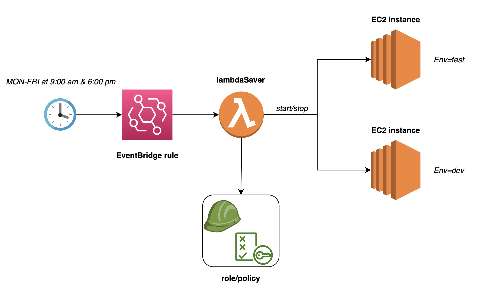

# lambda-saver

A lambda for optimized EC2 usage for dev and test environments

## Description

In the context of making technology more sustainable, there is room for tooling that enables an optimal usage
of cloud infrastructure. Lambda saver is a simple function that can be invoked to turn on and off development and
testing environments according to working hours.

This solution abstracts details such as, the periodicity of the event rule, the underlying infrastructure used for
hosting these environments, and the technique used to identify them, among others that are disregarded due to the
experimental nature of a proof of concept.

## Architecture

This solution consists of the following cloud resources:

- AWS Lambda
- AWS IAM Lambda execution role and policy
- AWS EventBridge rule
- EC2 instances (to exemplify its usage)

A rule is created to represent a working day schedule. The execution points are expected to be at 9:00 am and 6:00 pm. 
When the right time comes, the event rule will trigger the lambda execution.

The lambda itself is programmed to scan through the list of EC2 instances in a particular account and region, and
start/stop them based on the following condition:

- They are **tagged appropriately** (in this case with the `Env=dev` or `Env=test` tags)

That means that when the lambda is executed at 9:00 am, the expectation is that all stopped instances will be fired up,
and vice versa at 6:00 pm. This assumes that the initial state for these environments is already the expected one.

## How to use

You can use this tool in **two possible ways**:

- **Grab the latest artifact** generated from the GitHub actions workflow. After that you would need to [create a lambda](https://docs.aws.amazon.com/lambda/latest/dg/getting-started.html) in
AWS console (with the right permissions), and then create an [EventBridge rule](https://docs.aws.amazon.com/eventbridge/latest/userguide/eb-create-rule-schedule.html) afterwards.

- You can **clone the repository and build/deploy the artifact** yourself by executing:
   - Build the artifact locally `GOOS=linux go build -o build/main cmd/main.go`
   - Zip the binary `zip -jrm build/main.zip build/main`
   - Change directory to the infra dir `cd infra`
   - Run terraform workflow once authenticated in your cloud `terraform init`, 
`terraform plan`, and `terraform apply`